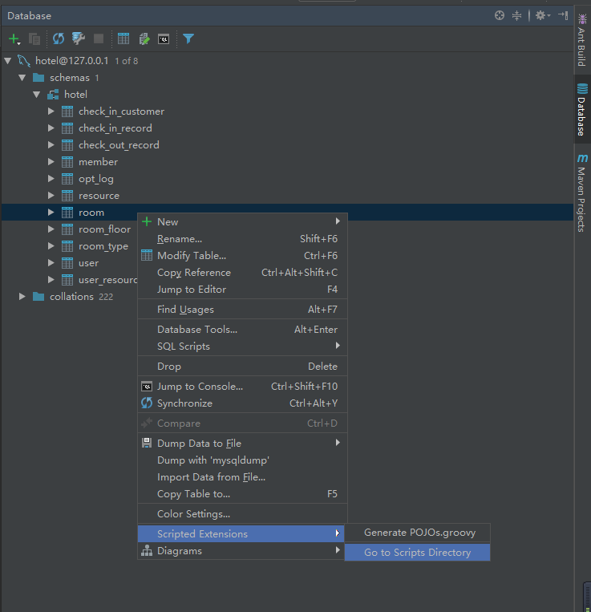
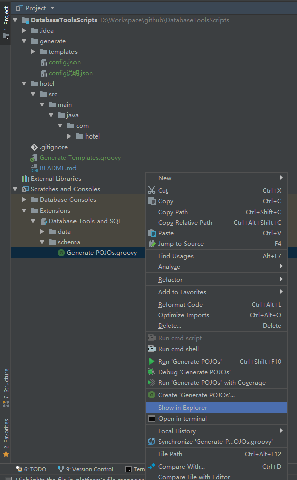
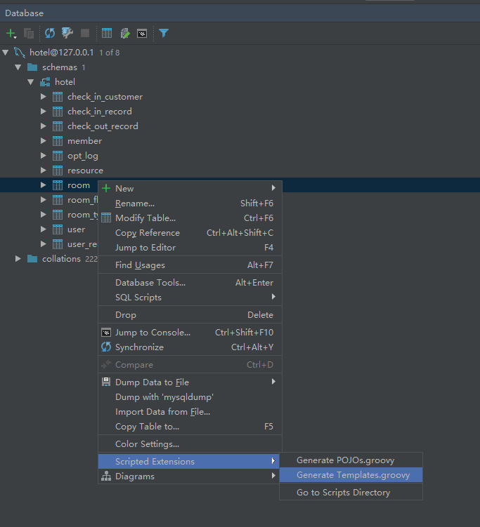
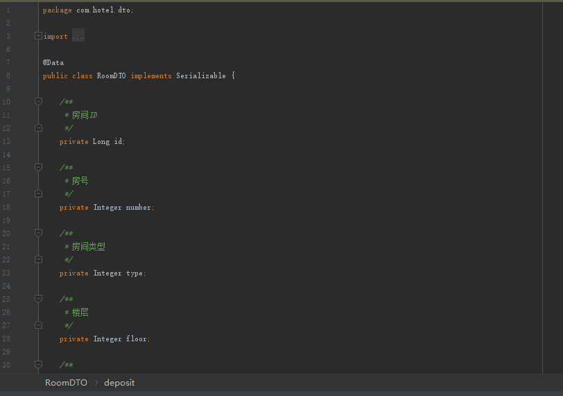
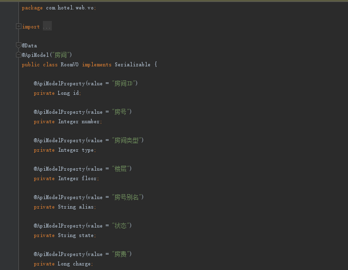
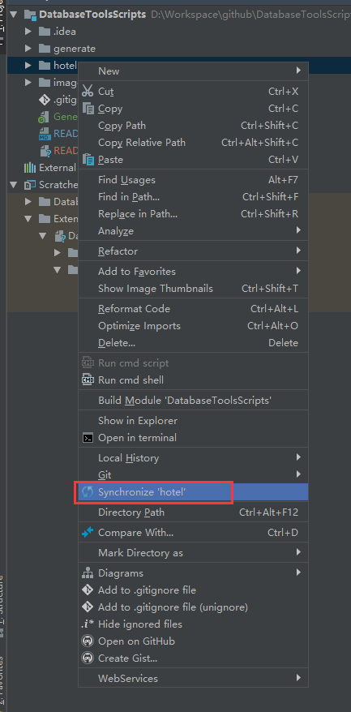

# DatabaseToolsScripts
IDEA Database Tools 生成代码脚本

#### 脚本说明
IntelliJ IDEA的Database Tools脚本， 可根据表信息自动生成代码， 基于自带的Generate POJOs.groovy脚本进行了修改， 支持自定义Velocity模板， 无需额外引入jar包。

#### 目录说明
simple-script: 简化版，无需配置文件，定义模版POJOTemplate.vm即可  
config-script: 配置版本，需要配置模版参数config.json

#### 放置脚本方法
展开右侧DatabaseTools， 任意表上右键 -> **Scripted Extensions -> Go to Scripts Directory**.  
  
左侧Project视图会自动展开Database Tools and SQL， 右键Show Explorer, 将Generate Templates.groovy放到和Generate POJOs.groovy同一目录  

#### 执行脚本方法
展开右侧DatabaseTools， 任意表上右键 -> **Scripted Extensions -> 点击对应groovy脚本**, 即可执行。

#### 生成结果示例：

### 如果以上操作后，代码或者脚本没在Project视图中显示， 请刷新一下

